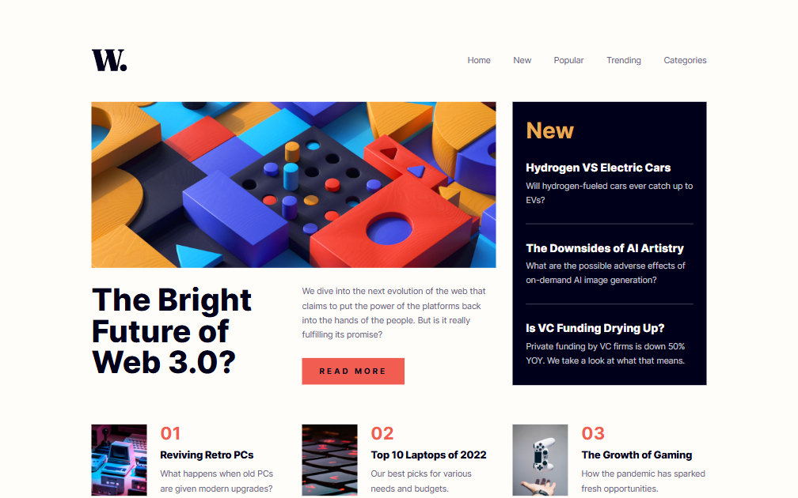

# News homepage solution | Frontend Mentor

This is a solution to the [News homepage challenge on Frontend Mentor](https://www.frontendmentor.io/challenges/news-homepage-H6SWTa1MFl). Frontend Mentor challenges help you improve your coding skills by building realistic projects. 

## Table of contents

- [Overview](#overview)
  - [The challenge](#the-challenge)
  - [Screenshot](#screenshot)
  - [Links](#links)
- [My process](#my-process)
  - [Built with](#built-with)
  - [What I learned](#what-i-learned)
  - [Continued development](#continued-development)
  - [Useful resources](#useful-resources)
- [Author](#author)
  - [Connect with Me](#Connect-with-Me)
  - [Coding Profiles](#Coding-Profiles)

## Overview

### The challenge

Users should be able to:

- View the optimal layout for the interface depending on their device's screen size
- See hover and focus states for all interactive elements on the page

### Screenshot

### Links

- [Solution URL](https://github.com/DalaScript/news-homepage)
- [Live Site URL](https://news-homepage-five-sand.vercel.app/)

## My process

### Built with

- [React](https://reactjs.org/) - JS library
- React Hooks – useState, useEffect, etc.
- JavaScript (ES6+) – For component logic and interactivity
- CSS Modules / Plain CSS (based on your file structure)
- Flexbox
- Mobile-first workflow

### What I learned

This project was my first complete React build done independently, and it was a solid step in structuring components and thinking in terms of reusable UI blocks. I practiced:

 - Building a fully responsive navigation system with a hamburger toggle, `aria-hidden`, and overlay logic for mobile devices.

 - Improved my state management using useState

 - Structuring reusable data-driven components like the `<Card />`, and using `map()` efficiently to render content from arrays.

 - Maintaining a clean separation between presentation and logic, splitting everything into meaningful folders and files.

### Continued development

am currently focused on advancing my skills in both frontend and backend development. On the frontend side, I am exploring modern frameworks and libraries such as React, Svelte, Tailwind CSS, and Ant Design to build responsive and dynamic user interfaces.

For backend development, I am working with technologies including Express.js, Next.js, Prisma, MySQL, and TypeScript to gain a deeper understanding of server-side logic, APIs, and database management.

My goal is to become a well-rounded developer by continuously learning and applying these tools in real-world projects.

### Useful resources

- [ChatGPT](https://chatgpt.com/) - He is my hero, if I need something fast, if I can't understand something, or if I can't find it on the internet, I always ask him.
- [W3Schools](https://www.w3schools.com/) - This is my favorite documentation platform I've been using since I started programming, it's the best explained resource.
- [MDN](https://developer.mozilla.org/en-US/) - This is also my favorite documentation platform, which I've been using a lot lately.
- [YouTube](https://www.youtube.com/) - I'm always looking for news and listening to other developers, sharing their experiences so that I can see many different solutions to a problem.

## Author

### Connect with Me

- [Instagram](https://www.instagram.com/DalaScript)
- [YouTube](https://www.youtube.com/@DalaScript)

### Coding Profiles

- [freeCodeCamp](https://www.freecodecamp.org/DalaScript)
- [FrontendMentor](https://www.frontendmentor.io/profile/DalaScript)
- [GitHub](https://github.com/DalaScript)
